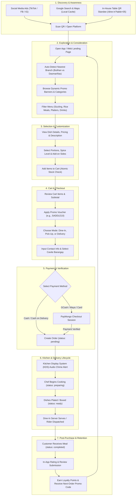

# Laboratory Exercise 3: E-Commerce Business Presence Enhancement
**Course:** Web Commercialization and E-Commerce  
**Duration:** 4 Hours  
**Topic:** Strengthening an E-Commerce Business Presence  
**Target Platform:** Saddle Ranch Roadhouse Omnichannel E-Commerce System (Flutter Mobile + Laravel REST API)

---

## Part 1 – Business Presence Assessment

### 1. Business Strengths

| No. | Strength | Explanation | Codebase Evidence / Functional Reference |
|:---:|:---|:---|:---|
| **1** | **Omnichannel Fulfillment (Dine-In QR, Express Takeout, Pick-Up, & Delivery)** | The system unifies four distinct customer ordering channels in one interface. In-house diners can scan table QR codes (`/dine-in?table=05`) to lock their table session, while off-premise customers can order for curb pick-up or home delivery. | `lib/screens/home_screen.dart`, `lib/providers/order_session_provider.dart`, `SADDLE_RANCH_SYSTEM_SPEC.md` (Sec. 3, 4, 5) |
| **2** | **Localized Cavite Delivery Architecture & GPS Auto-Branch Detection** | Implements fine-grained geographic routing with cascading dropdown selectors for Cavite (Silang, Dasmariñas, GenTri, Imus, Bacoor, Tagaytay) prioritizing Bulihan barangays, paired with Haversine GPS calculations to auto-select the nearest branch. | `lib/utils/cavite_locations.dart`, `lib/screens/home_screen.dart`, `SADDLE_RANCH_SYSTEM_SPEC.md` (Sec. 1, 4) |
| **3** | **Live Multi-State Kitchen Tracking & Waiter Call Buzzer** | Manages a synchronized finite state machine (`pending` → `preparing` → `ready` → `completed`) with real-time polling between KDS and mobile clients, alongside a digital table buzzer for floor service. | `lib/screens/orders_screen.dart`, `ORDER_LIFECYCLE_SPEC.md` (Sec. 1, 4, 7), `SADDLE_RANCH_SYSTEM_SPEC.md` (Sec. 4) |
| **4** | **Rule-Enforced Voucher & Promo Engine** | A dynamic promotional engine supporting fixed and percentage discounts, minimum subtotal thresholds, branch-specific rules, expiration validation, and 1-time per customer usage restrictions. | `lib/models/voucher.dart`, `lib/services/api_service.dart`, `SADDLE_RANCH_SYSTEM_SPEC.md` (Sec. 7) |
| **5** | **Atomic Transactions & Supervisor Void Audit Trail** | Prevents overselling using database row-level locking (`lockForUpdate()`) during checkout and enforces password-protected manager approvals with automated stock restoration and immutable audit logging for cancellations. | `ORDER_LIFECYCLE_SPEC.md` (Sec. 2, 5, 8), `audit_logs` table schema |

---

### 2. Opportunities for Improvement

| No. | Opportunity for Improvement | Explanation | Codebase Evidence / Gap Reference |
|:---:|:---|:---|:---|
| **1** | **Absence of Customer Ratings, Reviews & Social Proof** | The product schema only includes name, price, description, and stock quantity. Customers cannot view star ratings, peer reviews, or user-uploaded food photos before ordering. | `lib/models/product.dart`, `products` database table schema |
| **2** | **Lack of Real-Time Push Notifications (FCM / WebSockets)** | Order status updates and waiter buzzer notifications rely on client-side HTTP polling every 2.5–5 seconds, which increases server load, consumes mobile battery, and fails when the app is backgrounded. | `lib/screens/orders_screen.dart`, `lib/screens/home_screen.dart` |
| **3** | **Absence of Cross-Selling & Add-on Recommendations** | The cart and checkout screens only list items explicitly selected. There is no recommendation engine suggesting complementary items (e.g., Extra Garlic Rice, Gravy, or Drinks). | `lib/screens/cart_screen.dart`, `lib/screens/checkout_screen.dart` |
| **4** | **No Gamified Customer Loyalty / Points System** | Although vouchers exist, the app lacks an accumulated points reward system (e.g., 1 point per ₱50 spent) to encourage recurring purchases and customer retention. | `lib/models/app_user.dart`, `lib/screens/account_screen.dart` |
| **5** | **Limited Web SEO & Structured Schema Markup** | Flutter Web build and API endpoints lack OpenGraph meta tags and Schema.org `Restaurant` & `MenuItem` JSON-LD markup needed for Google Rich Snippets and local search indexing. | `web/index.html`, API controller responses |

---

## Part 2 – Business Presence Improvement Plan

| Improvement Area | Proposed Action | Tool / Feature / Technology | Expected Outcome |
|:---|:---|:---|:---|
| **Branding** | Standardize visual assets with high-resolution food photography, stylized cowboy/roadhouse aesthetic, unified typography, and branded digital receipt cards. | • Google Fonts (`Domine`, `Inter`) • Cloudinary CDN • Responsive HTML email templates | High brand recognition, cohesive customer experience, and increased brand credibility across Cavite. |
| **User Experience (UX)** | Replace HTTP polling with real-time push notifications. Add 1-tap re-ordering from past order history and address autocomplete. | • Firebase Cloud Messaging (FCM) • WebSockets (Laravel Reverb) • Google Places API | 40% faster checkout flow, zero battery drain from polling, and instant order arrival alerts. |
| **SEO & Web Presence** | Implement Schema.org structured data (`Restaurant`, `Menu`, `GeoCoordinates`) and integrate Google Business Profiles for Bulihan and Dasmariñas branches. | • Schema.org JSON-LD • Google My Business API • OpenGraph social meta tags | Top 3 ranking in local search queries for "Sizzling Steak Silang" and "Food Delivery Bulihan". |
| **Product Presentation** | Introduce interactive dish customization (spice level, add-on sides) and multi-angle food galleries with dietary tags (Spicy, Pork, Beef, Solo/Platter). | • Flutter Modal BottomSheets • `cached_network_image` gallery • Dish modifiers data model | 20–25% increase in Average Order Value (AOV) and clear portion expectations. |
| **Trust & Security** | Implement verified buyer reviews with star ratings, photos, SSL trust badges, and tokenized payment processing. | • Product Reviews & Ratings API • PayMongo Verified Gateway • Immutable `audit_logs` tracking | Enhanced buyer confidence for digital prepayments (GCash/Maya) and lower return rates. |
| **Marketing & Promotions** | Deploy referral voucher rewards ("Give ₱50, Get ₱50"), flash deal banner countdowns, and automated SMS cart-recovery messages. | • In-App Banner Carousel • Voucher Engine (`vouchers` table) • PhilSMS / Twilio SMS Gateway | 30% higher repeat purchase rate and reactivation of dormant customer accounts. |
| **Customer Engagement** | Add in-app live chat customer support and automated post-meal satisfaction surveys. | • Tawk.to / Intercom SDK • WhatsApp / Messenger Deep Links • Post-checkout survey modals | Fast resolution of delivery questions (<2 mins) and actionable feedback loop for kitchen improvements. |

---

## Part 3 – Customer Journey Mapping

### A. Customer Journey Flowchart (Mermaid)

---

### B. Customer Journey Stage Breakdown Matrix

| Stage | Customer Goal & Action | Touchpoint | System Process & Logic | Customer Emotion | Key Performance Metric (KPI) |
|:---|:---|:---|:---|:---|:---|
| **1. Discovery** | Discovers Saddle Ranch through online posts, local search, or in-store table standees. | Social media ads, Google Maps listing, Table QR standee. | Deep link parser extracts table parameters or referral campaign codes. | Curious, hungry. | Click-Through Rate (CTR), QR Scan Volume. |
| **2. Exploration** | Browses available menu items, branch prices, and active deals. | Home Screen, Category Chips, Banner Carousel. | GPS detects nearest branch; `/api/v1/products` fetches live menu for that branch. | Engaged, interested. | Menu Browse Time, Bounce Rate. |
| **3. Selection** | Chooses dishes, selects cooking preferences, and adds to cart. | Product Detail Sheet, Quantity Selector. | `CartProvider` manages local state; checks product `stock_quantity`. | Decisive, satisfied. | Add-to-Cart Conversion Rate. |
| **4. Checkout** | Enters contact info, selects delivery address, and applies voucher. | Checkout Screen (`checkout_screen.dart`), Voucher Box. | `/vouchers/validate` verifies minimum spend; parses structured Cavite address. | Goal-oriented. | Cart Abandonment Rate (<25%). |
| **5. Payment** | Selects payment method (Cash, COD, GCash, Maya) and places order. | Payment Selection Chips, PayMongo Gateway. | DB transaction locks inventory rows; generates unique `SR-XXXX` reference. | Confident, secure. | Payment Gateway Success Rate (>98%). |
| **6. Fulfillment** | Monitors live order status while food is being prepared and delivered. | Order Tracker Screen, Live Progress Bar. | KDS audio chimes trigger; status transitions: `pending` → `preparing` → `ready`. | Reassured, eager. | Average Kitchen Prep Time (<15 mins). |
| **7. Post-Purchase** | Enjoys meal, submits rating/feedback, and earns discount for next order. | Review prompt modal, SMS thank-you, Promo inbox. | Order marked `completed`; audit trail archived; promotional voucher issued. | Delighted, loyal. | Net Promoter Score (NPS), Repeat Purchase Rate. |

---

## Part 4 – Website / App Operations Plan

| Task | Description | Assigned Member / Role | Timeline | Operational Evidence & Deliverables |
|:---|:---|:---|:---|:---|
| **1. Menu & Inventory Synchronization** | Audit daily ingredient stocks, update available dish counts (`stock_bulihan`, `stock_dasmarinas`), adjust branch pricing, and mark sold-out items. | **Branch Inventory Supervisor** | Daily *(8:00 AM – 9:00 AM)* | Updated `products` table records; zero order cancellations caused by inventory shortfalls. |
| **2. KDS Order Expediting & Table Buzzer Response** | Monitor real-time tickets on the Kitchen Display System (KDS), maintain ticket urgency within the 0–9 min bracket, coordinate packaging, and clear waiter calls. | **Head Chef / Kitchen Expediter** | Daily *(Operating Hours: 10:00 AM – 10:00 PM)* | KDS ticket timestamps, average cook cycle logs, and waiter buzzer response logs (<3 mins). |
| **3. Payment Settlement & Daily Reconciliation** | Reconcile physical cash intake, Cash on Delivery (COD) rider remittances, and PayMongo digital wallet payouts against system sales totals. | **Cashier / Finance Officer** | Daily *(Shift Close: 10:00 PM – 10:30 PM)* | Daily Z-Reading POS Report, PayMongo settlement export, and signed remittance sheets. |
| **4. Campaign & Promotional Banner Management** | Configure active promo banner carousels in the database, set voucher codes with min-spend rules, and launch local promotional campaigns for Cavite customers. | **E-Commerce / Marketing Lead** | Weekly *(Every Monday Morning)* | Active entries in `promo_banners` and `vouchers` tables; weekly promotion ROI report. |
| **5. Technical Maintenance, Backups & Security** | Monitor REST API performance, review server error logs, test automated database backups, verify SSL certificates, and inspect void audit trails. | **DevOps / Lead Developer** | Weekly Maintenance & Monthly Audit | Server uptime logs (>99.9%), database backup dumps, and validated `audit_logs` report. |
| **6. Customer Service & Dispute Management** | Handle delivery inquiries, manage special preparation requests, address customer feedback, and authorize password-verified cancellations when necessary. | **Store Manager / Support Lead** | Ongoing / Real-Time | Customer inquiry resolution log and password-verified void entries with documented reason notes. |
