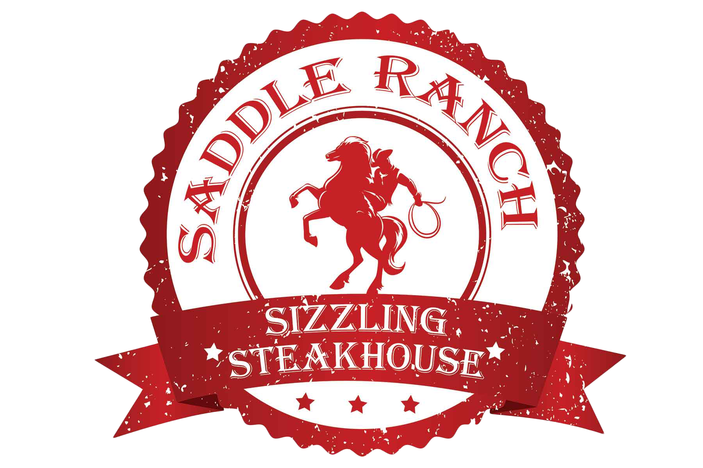

<div align="center">

  

  # Saddle Ranch Roadhouse Mobile Application

  **Enterprise Customer Companion Mobile Experience with Real-Time Table QR Dining, AI Concierge, Cascading Delivery Logistics, and PayMongo Digital Payments**

  <p align="center">
    
    
    
    
    
    
  </p>

  <p align="center">
    <a href="#client-showcase--confidentiality-disclosure">Client Showcase</a> &bull;
    <a href="#system-architecture">System Architecture</a> &bull;
    <a href="#core-operational-modules">Core Modules</a> &bull;
    <a href="#11-functional-parity-with-web">1:1 Web Parity</a> &bull;
    <a href="#technical-specifications">Technical Specs</a> &bull;
    <a href="#contributors--acknowledgments">Contributors</a> &bull;
    <a href="#proprietary-license--terms">License</a>
  </p>

</div>

---

## Client Showcase & Confidentiality Disclosure

This enterprise mobile ordering companion was engineered for **Saddle Ranch Roadhouse**, a premier multi-branch steakhouse and sizzling grill chain operating across Silang, Bulihan, and Dasmari&ntilde;as in Cavite, Philippines.

### Portfolio Showcase Authorization
While several enterprise client platforms engineered under professional contract remain strictly confidential under Non-Disclosure Agreements (NDAs), **Saddle Ranch Roadhouse has authorized this public portfolio exhibition**. This repository demonstrates mobile software architecture, real-time client-server synchronization, contactless QR table dining, and payment gateway integration.

> **Confidentiality & Compliance Notice**: The client has authorized public review of system architecture, technical documentation, and visual interface flows. In compliance with client data privacy and intellectual property agreements, proprietary database contents, operational passwords, API credentials, customer PII, and production server secrets remain strictly confidential and are not published for public execution.

---

## System Architecture

The Saddle Ranch Mobile application connects directly with the unified Laravel 11 enterprise REST API backend, sharing live inventory, table states, kitchen queues, and voucher engines with the web platform.

```
+-----------------------------------------------------------------------------------+
|                     SADDLE RANCH MOBILE APP (FLUTTER 3.x)                         |
|   - Apple-Inspired Light / Pure White UI   - 1:1 REST API Parity with Web         |
|   - Real-Time Order Polling Engine         - Embedded Interactive AI Concierge    |
+-----------------------------------------+-----------------------------------------+
                                          |
                                          v  [HTTPS / JSON REST API]
+-----------------------------------------------------------------------------------+
|                        SADDLE RANCH CORE REST API BACKEND                         |
|   - Laravel 11 + Sanctum / Session Auth    - Atomic MySQL / SQLite Relational DB  |
|   - Regulatory Tax & Discount Engines      - Real-Time Table Session Protection   |
+-------------------+-------------------------------------------+-------------------+
                    |                                           |
                    v                                           v
      +---------------------------+               +---------------------------+
      |    POINT-OF-SALE (POS)    |               |   KITCHEN DISPLAY (KDS)   |
      | - Station Table Locks     |               | - Real-Time Cook Pipeline |
      | - Unlock Request Alerts   |               | - Grill Station Timers    |
      | - Waiter Call Chime Queue |               | - Inventory Decrement     |
      +---------------------------+               +---------------------------+
```

---

## Core Operational Modules

### 1. Customer E-Commerce & Delivery Engine
- **Synchronized Categorized Catalog**: Sizzling Rice Meals, Authentic Filipino Cuisines, Barkada Platters, and Specialty Drinks, with real-time branch-specific pricing for Bulihan and Dasmariñas.
- **Cascading Geographical Delivery Selector**: Municipality and barangay cascading selector for Cavite province, with automatic branch dispatch (Bulihan cluster vs. Dasmariñas) and fee waiver rules.
- **Payment-First Delivery Policy**: Enforces digital payments via PayMongo (QRPh, GCash, Maya, Cards) for remote delivery orders to safeguard rider dispatch.
- **Live Active Order Tracking**: 5-second background polling retrieving stage progression (`pending` $\rightarrow$ `preparing` $\rightarrow$ `ready` $\rightarrow$ `completed`) with itemized thermal receipt modals.

---

### 2. In-House Contactless QR Table Dining
- **Barcode & Deep Link Scanner**: Native camera scanner recognizing QR codes and deep links (`saddleranch://dine-in/02` or `?table=02`).
- **Table Session Lock Protection**: Validates table active status against the cashier station. If closed, displays an informative locked gate and prevents unauthorized orders.
- **Table Unlock Requests**: Dispatches an unlock notification directly to the cashier's POS terminal with 2.5-second live status polling. Once unlocked, the customer is instantly cleared to order.
- **Waiter Calling Buzzer**: In-app service buzzer alerting the POS terminal with audio chimes and visual prompts (`idle` $\rightarrow$ `pending` $\rightarrow$ `acknowledged`).

---

### 3. Embedded AI Concierge & Real-Time Chatbot
- **Interactive Assistance**: Provides instant, conversational guidance regarding restaurant policies, operating hours, branch addresses, and promo rules.
- **Live Menu Price Querying**: Dynamically fetches active items and branch-tailored prices directly from `/api/v1/products`.
- **Typewriter Streaming Animation**: Smooth, realistic typewriter text streaming with AI reflection delays.
- **One-Tap Promo Code Clipboard**: Clickable code pills (e.g., `WELCOME50`, `SADDLE10`) that copy directly to the customer's device clipboard with haptic feedback.
- **Quick Action Chips**: Instant shortcuts for 📍 Locations, 🕒 Hours, 🥩 Menu Prices, 🎉 Promos, and 🏷️ Vouchers.

---

### 4. Integrated Digital Payments (PayMongo Gateway)
- **Multi-Rail Digital Payments**: Hosted checkout integration supporting QRPh, GCash, Maya, and Visa/Mastercard debit and credit cards.
- **External App Launcher**: Seamlessly transitions the customer to PayMongo hosted checkout and provides post-payment confirmation dialogs that update kitchen tickets instantly.

---

### 5. Promotional Campaign & Voucher System
- **Voucher Validation Engine**: Real-time validation against `/api/v1/vouchers/validate`, evaluating minimum spend, validity windows, branch exclusions, and percentage/fixed discounts.
- **Customer Voucher Wallet**: Retrieves account-bound coupons and promotional vouchers.

---

### 6. Apple-Inspired Pure White Design System
- **Light / White Aesthetic**: Built using an elegant palette featuring pure white cards (`#FFFFFF`), light canvas background (`#FBFBFD`), dark charcoal typography (`#1F2937`), and warm amber accents (`#F59E0B`).
- **Tactile Feedback**: Integrated iOS/Android haptic feedback across buttons, steppers, and modals.

---

## 1:1 Functional Parity with Web

| Module | Web Application | Mobile Application | Parity Status |
| :--- | :--- | :--- | :---: |
| **Pick-Up Online Ordering** | Full branch & time slot selector | Branch, time slot, and contact selector | **1:1 Matched** |
| **Delivery Ordering** | Cavite municipality/barangay cascades | Cavite locations cascade & fee logic | **1:1 Matched** |
| **In-House QR Table Dining** | Browser QR URL routing | Mobile scanner + deep link routing | **1:1 Matched** |
| **Table Lock Protection** | Cashier station table enforcement | Active check + Table Unlock request | **1:1 Matched** |
| **Waiter Calling Buzzer** | POS audio chime alert | In-app buzzer state machine | **1:1 Matched** |
| **Interactive AI Chatbot** | Typewriter floating assistant | Typewriter AI modal + live prices | **1:1 Matched** |
| **PayMongo Digital Payments** | QRPh / GCash / Maya checkout | External app checkout & confirmation | **1:1 Matched** |
| **Real-Time Order Tracking** | Tracking by order / phone number | Active order 5s polling & receipt modal | **1:1 Matched** |
| **Customer Authentication** | Email/Password & Google OAuth | Email/Password & Google OAuth | **1:1 Matched** |

---

## Technical Specifications

| Layer | Component | Description |
| :--- | :--- | :--- |
| **Mobile Framework** | Flutter 3.x / Dart 3.x | Cross-platform native application for iOS and Android |
| **State Management** | Provider 6.x | Reactive scoped state for Auth, Cart, Menu, and Session |
| **Design System** | Apple Light Mode | Pure white surfaces (`#FFFFFF`), light canvas (`#FBFBFD`), Lucide Icons |
| **Typography** | Google Fonts | Domine serif headers, Work Sans body, Space Mono codes |
| **Networking & HTTP** | `http` 1.6+ | Custom REST client with auth interceptors and retry handlers |
| **Hardware Scanning** | `mobile_scanner` 7.x | High-speed QR barcode camera engine with torch and auto-focus |
| **Deep Linking** | `app_links` 7.x | Parses universal links and custom schemes (`saddleranch://`) |
| **Secure Storage** | `flutter_secure_storage` | Hardware-backed encrypted storage for Sanctum bearer tokens |
| **Automated Testing** | `flutter_test` | Unit, widget, and integration test coverage |

---

## Getting Started & Local Development

### Prerequisites
- Flutter SDK (3.22+ recommended)
- Android Studio / Xcode for simulator testing
- Running instance of the [Saddle Ranch Web API Backend](https://github.com/kidlatpogi/Saddle-Ranch-Web)

### Installation
```bash
# 1. Clone the repository
git clone https://github.com/kidlatpogi/saddle-ranch-mobile-.git
cd saddle-ranch-mobile-

# 2. Install Flutter dependencies
flutter pub get

# 3. Configure API Base URL in lib/core/config/api_config.dart
# For Android Emulator: http://10.0.2.2:8000/api/v1
# For Physical Device / iOS: http://<YOUR_LOCAL_IP>:8000/api/v1

# 4. Run automated test suite
flutter test test/image_url_helper_test.dart test/menu_category_sort_test.dart test/widget_test.dart test/ai_chatbot_test.dart

# 5. Launch the application
flutter run
```

---

## Contributors & Acknowledgments

- **Lead Mobile Engineer & Architect**: Mobile architecture, Apple-style UI design system, QR table state machine, AI concierge integration, and full REST backend parity.
- **Backend Infrastructure**: Integrated with the Saddle Ranch Web Laravel 11 enterprise platform.

---

## Proprietary License & Terms

```
PROPRIETARY & CONFIDENTIAL — ALL RIGHTS RESERVED
Copyright (c) 2026 Saddle Ranch Roadhouse.

This repository is presented strictly for professional portfolio review and architectural evaluation.
Unauthorized copying, duplication, reproduction, reverse engineering, redistribution, or commercial
exploitation of this codebase, design assets, or proprietary system logic is strictly prohibited.
```
