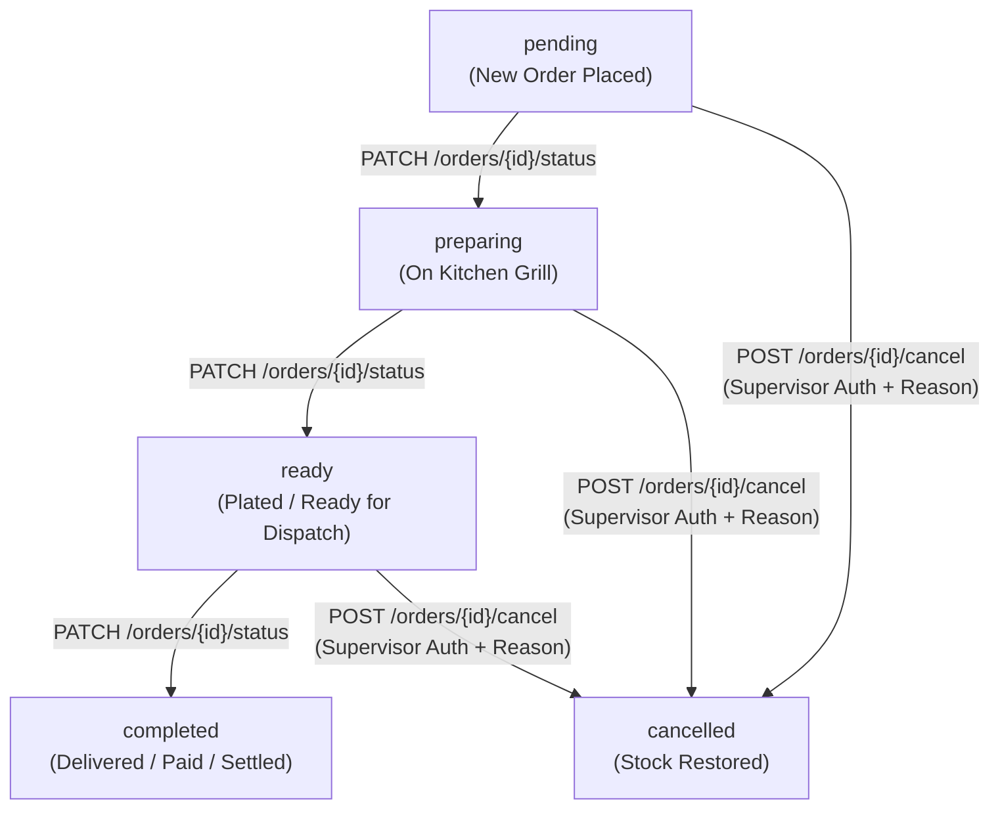
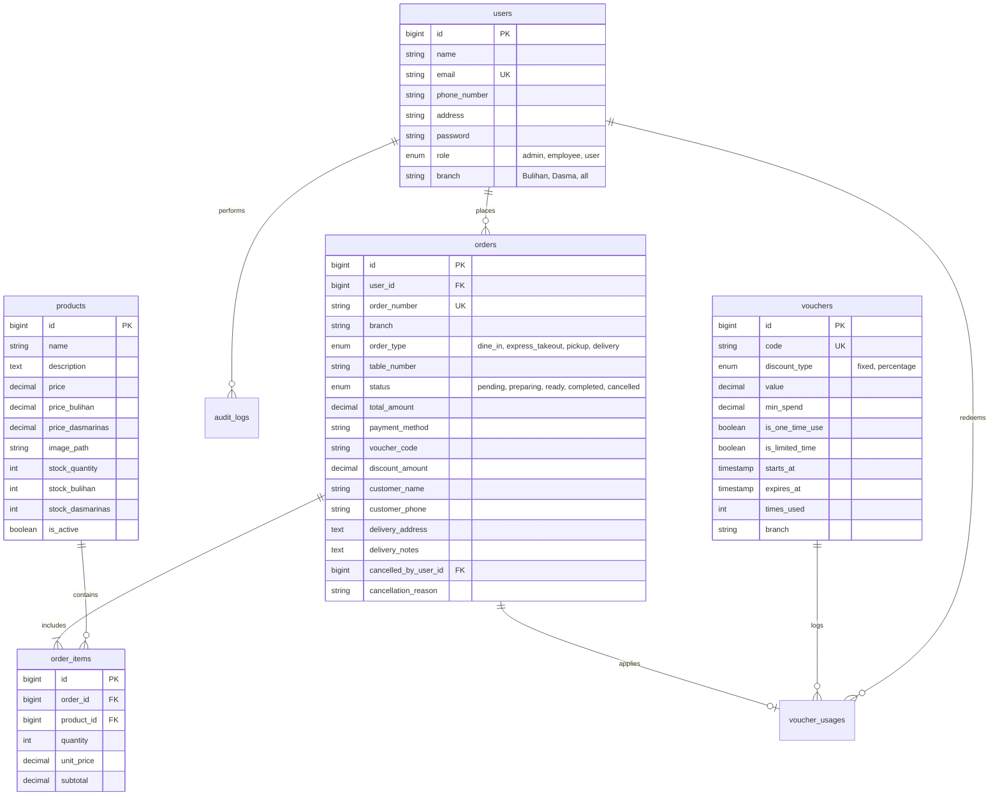
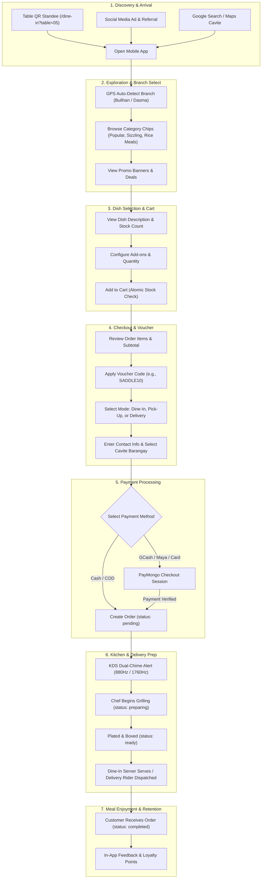

# 🤠 Saddle Ranch Roadhouse — Mobile Application & Omnichannel System

[](https://flutter.dev)
[](https://dart.dev)
[](https://pub.dev/packages/provider)
[](https://laravel.com)
[](https://paymongo.com)

An enterprise-grade, high-performance Flutter mobile application built for **Saddle Ranch Roadhouse**, providing a seamless, real-time omnichannel food ordering and fulfillment experience across Cavite, Philippines. The app maintains **1:1 feature and operational parity** with the Saddle Ranch Web POS, Kitchen Display System (KDS), and Live Order Tracker.

---

## 📑 Table of Contents

1. [System Overview & Key Features](#-system-overview--key-features)
2. [Visual Design System & Brand Identity](#-visual-design-system--brand-identity)
3. [Architecture & Project Structure](#-architecture--project-structure)
4. [Order Lifecycle & State Machine](#-order-lifecycle--state-machine)
5. [Fulfillment Modes & Cavite Delivery Specification](#-fulfillment-modes--cavite-delivery-specification)
6. [Kitchen Display System (KDS) & Cook Aggregator](#-kitchen-display-system-kds--cook-aggregator)
7. [Supervisor Void & Security System](#-supervisor-void--security-system)
8. [Voucher & Promotional Discount Engine](#-voucher--promotional-discount-engine)
9. [Complete REST API Reference](#-complete-rest-api-reference)
10. [Database Architecture & Schema](#-database-architecture--schema)
11. [Customer Journey Mapping](#-customer-journey-mapping)
12. [Operations & Maintenance Plan](#-operations--maintenance-plan)
13. [Getting Started & Development](#-getting-started--development)

---

## 🚀 System Overview & Key Features

Saddle Ranch Roadhouse unifies four distinct customer ordering channels into a single cohesive mobile experience:

* **🍽️ In-House QR Table Ordering (`dine_in` & `express_takeout`):** Customers scan a physical QR code on their table (e.g., `/dine-in?table=05`) to lock their active table session, browse the live menu, order directly to the kitchen, and summon service staff using the digital **Waiter Call Buzzer**.
* **🛍️ Curbside Pick-Up (`pickup`):** Allows off-premise diners to schedule preparation times (`ASAP (15-20 mins)`, `30 mins`, `45 mins`, `1 hour`), customize cooking requests, and pick up orders at their designated branch.
* **🛵 Cavite Local Delivery (`delivery`):** Comprehensive localized delivery engine with structured cascading selectors covering Silang (Bulihan cluster), Dasmariñas City, General Trias, Imus, Bacoor, and Tagaytay.
* **📍 Dual-Branch Multi-Menu Inventory:** Real-time branch switcher (**Bulihan Branch** and **Dasmariñas Branch**) featuring branch-specific item pricing and independent inventory counts (`stock_bulihan` vs `stock_dasmarinas`).
* **💳 Flexible Multi-Channel Payments:** Direct support for Cash, Cash on Delivery (COD), GCash, Maya, QRPH, and Credit/Debit Cards powered by PayMongo Checkout Sessions.
* **🔒 Enterprise Authentication & Security:** Secure tokenized authentication via Laravel Sanctum, 6-digit email OTP verification, password reset flows, and supervisor-authorized void operations.

---

## 🎨 Visual Design System & Brand Identity

The mobile application utilizes a customized **Light Cowboy Roadhouse** aesthetic engineered with Google Fonts for premium typography and high contrast:

```
┌─────────────────────────────────────────────────────────────┐
│                    LIGHT COWBOY PALETTE                     │
├─────────────────────────────────────────────────────────────┤
│ • Primary Background:   Clean White        (#FFFFFF)        │
│ • Card Surface:         Light Slate        (#F8FAFC/#F1F5F9)│
│ • Primary Accent:       Sizzling Orange    (#FF6B00/#EA580C)│
│ • Headlines & Titles:   Deep Cast-Iron     (#09090B/#18181B)│
│ • Subtitles & Muted:    Charcoal Grey      (#71717A)        │
│ • Success / Verified:   Emerald Green      (#2E7D32/#30D158)│
│ • Danger / Error:       Crimson Red        (#D32F2F/#FF453A)│
└─────────────────────────────────────────────────────────────┘
```

* **Typography:**
  * **Headlines & Hero Banners:** `GoogleFonts.domine` (Classic serif bold styling)
  * **UI Elements, Buttons, & Forms:** `GoogleFonts.inter` (Clean, modern, legible sans-serif)
* **Branding:**
  * Upper-left corner logo placement on Login screen.
  * Centered brand logo on Create Account, Verify Email, and Password Reset screens.

---

## 🏗️ Architecture & Project Structure

The project follows a clean, modular architecture separating UI presentation, business state management, data models, and network services:

```text
lib/
├── core/
│   ├── config/              # API endpoints, URLs, and Auth configuration
│   │   ├── api_config.dart
│   │   └── google_auth_config.dart
│   └── theme/               # Core theme tokens and styling
│       └── app_theme.dart
├── models/                  # Immutable Dart data models
│   ├── app_user.dart
│   ├── cart_item.dart
│   ├── order_result.dart
│   ├── product.dart
│   ├── promo_banner.dart
│   ├── register_status.dart
│   └── voucher.dart
├── providers/               # Provider-based state management
│   ├── auth_provider.dart
│   ├── cart_provider.dart
│   ├── menu_provider.dart
│   └── order_session_provider.dart
├── screens/                 # Application views and flows
│   ├── account_screen.dart
│   ├── auth_gate.dart
│   ├── auth_screen.dart
│   ├── cart_screen.dart
│   ├── checkout_screen.dart
│   ├── forgot_password_screen.dart
│   ├── home_screen.dart
│   ├── login_screen.dart
│   ├── menu_screen.dart
│   ├── orders_screen.dart
│   ├── profile_setup_screen.dart
│   ├── qr_scanner_screen.dart
│   ├── register_screen.dart
│   ├── reset_password_screen.dart
│   └── verify_email_screen.dart
├── services/                # API client and networking
│   └── api_service.dart
├── theme/                   # Apple/Roadhouse theme definitions
│   ├── app_theme.dart
│   └── apple_theme.dart
├── utils/                   # Location constants, helpers, and formatters
│   ├── cavite_locations.dart
│   ├── deep_link_parser.dart
│   ├── image_url_helper.dart
│   ├── menu_category.dart
│   └── ph_mobile_number.dart
└── widgets/                 # Reusable UI components
    ├── apple_food_card.dart
    ├── banner_carousel.dart
    ├── category_chips.dart
    ├── confirmation_modal.dart
    ├── glass_cart_bar.dart
    ├── product_card.dart
    ├── table_banner.dart
    └── view_order_modal.dart
```

---

## 🔄 Order Lifecycle & State Machine

Every order placed moves through a strictly governed finite state machine synchronized across the Mobile Client, Web POS, Kitchen Display System (KDS), and Live Order Tracker:



### State Transition Matrix & Rules

| Current Status | Allowed Next Status | Triggering Actor | System Actions |
|---|---|---|---|
| **`pending`** | `preparing` | Head Chef / Grill Cook | Moves ticket to active grill queue; KDS card turns sizzling amber/yellow. |
| **`preparing`** | `ready` | Head Chef / Expediter | Food is plated/packaged; KDS card turns blue; Server or Delivery Rider dispatched. |
| **`ready`** | `completed` | Cashier / Server / Rider | Customer receives food and payment is settled. Branch inventory deducted permanently. |
| **`pending` / `preparing` / `ready`** | `cancelled` | Manager / Supervisor | **BLOCKED on status patch.** Requires `POST /orders/{id}/cancel` with password authorization. Stock is restored atomically. |
| **`completed`** | None (Terminal) | - | Order is closed and archived. |
| **`cancelled`** | None (Terminal) | - | Order is voided, non-reversible, and audit logged. |

---

## 📍 Fulfillment Modes & Cavite Delivery Specification

### 1. Delivery Geographic Hierarchy

The application integrates structured cascading dropdown selectors for Cavite province with first-class focus on the **Bulihan** cluster:

* **Bulihan Core Barangays:** `Anahaw II`, `Anahaw I`, `Acacia`, `Banaba`, `Ipil I`, `Ipil II`, `Narra I`, `Narra II`, `Narra III`, `Yakal`, `Bulihan Proper`.
* **Cavite Municipalities & Cities:**
  * **Silang:** Bulihan barangays + `Biga I`, `Biga II`, `Carmen`, `Lucsuhin`, `Poblacion I & II`, `Sabutan`, `San Vicente`, `Tubuan`.
  * **Dasmariñas City:** `Sampaloc 1 & 2`, `Salawag`, `Paliparan 1, 2 & 3`, `Langgaan`, `San Agustin 1 & 2`.
  * **General Trias:** `Manggahan`, `San Francisco`, `Navarro`, `Tejero`.
  * **Imus City:** `Anabu I-A`, `Bucandala`, `Malagasang I-A`, `Poblacion`.
  * **Bacoor City:** `Molino 1, 2 & 3`, `Queens Row`.
  * **Tagaytay City:** `Maharlika`, `Mendez Crossing`, `Sungay`.

### 2. Standard Delivery Address Format
```text
"${streetAddress.trim()}, Brgy. ${barangay}, ${city}, ${province}, Region IV-A (CALABARZON)"
```
*(Example: `"Blk 26 Lot 17 Narra St., Brgy. Anahaw II, Silang, Cavite, Region IV-A (CALABARZON)"`)*

### 3. GPS Auto-Branch Detection (Haversine Formula)
When location permission is granted, the app calculates distance to both branches:
* **Bulihan Branch:** `14.2882° N, 120.9785° E`
* **Dasmariñas Branch:** `14.3294° N, 120.9367° E`
The nearest branch is automatically selected to ensure faster delivery and accurate menu pricing.

---

## 🍳 Kitchen Display System (KDS) & Cook Aggregator

Touchscreen terminal integration for line cooks and kitchen expediters:

### Ticket Urgency Matrix
Elapsed prep time is calculated as `(currentTime - created_at) / 60000`:
* 🟢 **0 – 9 Minutes (Normal):** `#1E1710` Amber-gold border. Standard prep and grill cycle.
* 🟡 **10 – 14 Minutes (Warning Alert):** `#221E16` Bright yellow border. Expediter alerts station cook.
* 🔴 **15+ Minutes (Critical Delay):** `#261416` Rose-red pulse. Head Chef prioritizes immediate plate-out.

### Live Cook Aggregator Formula
The KDS side panel dynamically sums required batch quantities across active tickets:
$$\text{Total Batch Quantity} = \sum_{\text{active tickets}} \text{item.quantity}$$
*(e.g., 🔥 12x Sizzling Sisig, 🔥 6x T-Bone Steak, 🔥 4x Bulalo Steak, 🔥 18x Extra Garlic Rice).*

---

## 🛡️ Supervisor Void & Security System

To prevent employee theft or unexplained inventory shrinkage, order cancellations cannot be executed through regular status updates.

### Cancellation Endpoint
* **Method & URL:** `POST /api/v1/orders/{id}/cancel`
* **Payload:**
  ```json
  {
    "password": "supervisor_admin_password",
    "reason": "Customer cancelled prior to grill preparation / Incorrect table entered"
  }
  ```

### Atomic Database Transaction
1. Verifies supervisor password against `users.password` using `Hash::check()`.
2. Validates order status is not already `cancelled`.
3. Marks status as `cancelled`, records `cancelled_by_user_id` and `cancellation_reason`.
4. Atomically restores stock to `products.stock_quantity`, `products.stock_bulihan`, or `products.stock_dasmarinas`.
5. Writes an immutable audit trail entry in the `audit_logs` table.

---

## 🏷️ Voucher & Promotional Discount Engine

The voucher engine evaluates checkout eligibility before discount application:

1. **Voucher Validation Rules:**
   * Checks `vouchers.is_active`, `starts_at`, and `expires_at`.
   * Checks `min_spend`: Order subtotal must equal or exceed `min_spend`.
   * Evaluates branch constraints: `'all'`, `'bulihan'`, or `'dasmarinas'`.
   * Evaluates `is_one_time_use`: Queries `voucher_usages` table to ensure the customer has not previously redeemed the code.
2. **Discount Computation:**
   * **Fixed Discount (`fixed`):** `discount = min(voucher.value, subtotal)`
   * **Percentage Discount (`percentage`):** `discount = subtotal * (voucher.value / 100.0)`
3. **Usage Lock:** Increments `times_used` and logs the transaction upon order creation.

---

## 📡 Complete REST API Reference

Base URL: `https://saddle-ranch-api.onrender.com/api/v1` (or local development server)

### 1. Authentication Endpoints

| Method | Endpoint | Description |
|---|---|---|
| `POST` | `/auth/login` | Log in with email & password; returns Sanctum bearer token and user object. |
| `POST` | `/auth/register` | Register customer account; triggers 6-digit email verification code. |
| `POST` | `/auth/verify-email` | Verify 6-digit OTP code (`code`, `token`, `otp`, `verification_code`). |
| `POST` | `/auth/resend-verification` | Resend 6-digit verification code to email. |
| `POST` | `/auth/forgot-password` | Request 6-digit password reset code. |
| `POST` | `/auth/reset-password` | Submit 6-digit reset code and new password. |
| `GET` | `/auth/user` | Fetch currently authenticated user profile. |
| `POST` | `/auth/logout` | Revoke active Sanctum session token. |

### 2. Menu, Categories & Banners

| Method | Endpoint | Description |
|---|---|---|
| `GET` | `/products` | Fetch active menu items (supports `?branch=bulihan` or `?branch=dasmarinas`). |
| `GET` | `/products/{id}` | Fetch individual product details and branch pricing. |
| `GET` | `/promo-banners` | Fetch active promotional banner slides for the home carousel. |

### 3. Orders, Checkout & Live Tracking

| Method | Endpoint | Description |
|---|---|---|
| `POST` | `/orders` | Create new order (Dine-In, Takeout, Pick-Up, or Delivery) with row locking. |
| `GET` | `/orders` | Fetch past order history for authenticated customer. |
| `GET` | `/orders/{id}` | Fetch single order invoice and status details. |
| `GET` | `/orders/track?query={order_number}` | Real-time live status tracking for customer orders. |
| `PATCH`| `/orders/{id}/status` | Transition order status (`pending` → `preparing` → `ready` → `completed`). |
| `POST` | `/orders/{id}/cancel` | Supervisor-authorized order void with password validation. |

### 4. Vouchers & In-House Assistance

| Method | Endpoint | Description |
|---|---|---|
| `POST` | `/vouchers/validate` | Validate promo code, subtotal threshold, and calculate discount. |
| `POST` | `/tables/call-waiter` | Send table buzzer assistance alert to floor staff. |

---

## 🗄️ Database Architecture & Schema



---

## 🗺️ Customer Journey Mapping



---

## 💼 Operations & Maintenance Plan

| Operational Area | Frequency | Assigned Role | Key Deliverables & Procedures |
|---|---|---|---|
| **Inventory & Menu Sync** | Daily *(8:00 AM – 9:00 AM)* | **Branch Inventory Lead** | Reconcile physical ingredient stocks with `stock_bulihan` and `stock_dasmarinas`. Adjust daily sold-out items. |
| **KDS Expediting & Buzzer** | Real-Time *(10:00 AM – 10:00 PM)* | **Head Chef / Expediter** | Maintain ticket turnaround under 10 minutes. Respond to digital waiter calls within 3 minutes. |
| **Payment Reconciliation** | Daily *(Shift Close 10:00 PM)* | **Cashier / Finance Officer** | Match physical cash, COD remittances, and PayMongo portal payouts with daily sales ledger. |
| **Promotions & Banners** | Weekly *(Mondays)* | **Marketing Manager** | Publish dynamic banner promotions and configure seasonal discount codes in `vouchers`. |
| **Server & API Maintenance** | Weekly / Monthly | **DevOps / Lead Developer** | Verify API uptime, inspect `audit_logs` for void trails, test database backups, and renew SSL certificates. |
| **Dispute & Void Approval** | As Needed | **Store Manager** | Verify cancellation reasons and provide supervisor password for order voids. |

---

## 🛠️ Getting Started & Development

### Prerequisites
* **Flutter SDK:** `^3.27.0`
* **Dart SDK:** `^3.6.0`
* **Android Studio / Xcode / VS Code** with Flutter extensions
* Active connection to the Saddle Ranch Laravel Backend API

### Installation

1. **Clone the repository:**
   ```bash
   git clone https://github.com/crazysen/saddle-ranch-mobile-.git
   cd saddle-ranch-mobile-
   ```

2. **Install dependencies:**
   ```bash
   flutter pub get
   ```

3. **Verify analyzer status:**
   ```bash
   flutter analyze
   ```

4. **Run test suite:**
   ```bash
   flutter test
   ```

5. **Launch application:**
   * **Chrome (Web):**
     ```bash
     flutter run -d chrome
     ```
   * **Android / iOS Device:**
     ```bash
     flutter run
     ```

---

## 📄 License
This project is proprietary software created for **Saddle Ranch Roadhouse**. All rights reserved.

